# GitHub MCP Demo - DevOps Workflow Demonstration

## 🎯 Demo Scenario Overview

This project is the **first installment** in a comprehensive AI development workflow series, demonstrating **human-guided AI workflows** where AI provides assistance but requires step-by-step direction.

**Demo Series Evolution:**
- **This Demo**: **Human-guided AI workflow (AI as tool)**
- **[GitHub Coding Agent Demo](https://github.com/david-pizzi-cg/github-coding-agent-demo)**: Autonomous AI workflow (AI as teammate)
- **[GitHub Copilot Instructions Demo](https://github.com/david-pizzi-cg/github-copilot-instructions-demo)**: Safeguards AI workflow (AI as quality gatekeeper)

This project demonstrates a complete DevOps workflow using the **GitHub MCP (Model Context Protocol) Server** integration with VS Code Copilot, showcasing how AI can assist in the entire software development lifecycle from issue detection to deployment through a human-in-the-loop approach.

## 📋 Demo Scenario: CSS Stylesheet Bug

### 🐛 **The Demo Scenario**

The World Clock web application has a **critical bug** - the CSS stylesheet is not loading due to a typo in the HTML file:

**File**: `index.html` (line 7)  
**Issue**: `<link rel="stylesheet" href="styls.css">` ❌ (missing 'e')  
**Should be**: `<link rel="stylesheet" href="styles.css">` ✅

**Impact**: The entire page appears unstyled, breaking the user experience completely.

### 🧠 **The Human-Guided Strategy**

This demo showcases the traditional approach where AI serves as a powerful assistant, but requires human guidance at each step:

1. **Manual Issue Discovery**: Human identifies the problem and guides AI investigation
2. **Step-by-Step Workflow**: AI executes each phase with explicit human prompts
3. **Human Decision Making**: User makes all strategic decisions about branching, merging, etc.
4. **Assisted Execution**: AI handles technical implementation but follows human direction

## 🎯 Learning Objectives

This demo showcases:
- **Human-Guided AI Development**: How to direct AI through each step of the workflow
- **GitHub MCP Integration**: Seamless GitHub operations from VS Code using MCP tools
- **DevOps Fundamentals**: Complete workflow from issue discovery to deployment
- **Best Practices**: Proper branching, commit messages, and PR management
- **Collaborative Development**: Issue tracking and code reviews with AI assistance
- **Foundation Skills**: Building blocks for more advanced AI workflows

## 🔄 Workflow Diagram

```mermaid
graph TD
    P[🔧 Pre-Demo Setup: Create Demo Branch]
    P --> A[🔍 Phase 1: Issue Discovery]
    A --> B[📝 Phase 2: Issue Management via GitHub MCP]
    B --> C[🌿 Phase 3: Create Hotfix Branch]
    C --> D[🛠️ Phase 4: Local Development & Fix]
    D --> E[📤 Phase 5: Push & Create PR]
    E --> F[🎉 Phase 6: Merge & Close Issue]
    F --> G[🔧 Phase 7: Post-Demo Cleanup]
    
    P1["Create 'demo' branch for safe demonstration"] --> P
    A1["Human: Website styling broken! AI: Investigate"] --> A
    B1["Create issue with MCP tools"] --> B
    C1["Branch: hotfix/css-stylesheet-typo"] --> C
    D1["Fix: styls.css → styles.css"] --> D
    E1["Push + Auto-link PR to issue"] --> E
    F1["Merge PR + Close issue"] --> F
    G1["Delete demo branch & cleanup"] --> G
    
    style P fill:#ff6b6b
    style A fill:#4ecdc4
    style B fill:#45b7d1
    style C fill:#96ceb4
    style D fill:#feca57
    style E fill:#ff9ff3
    style F fill:#a8e6cf
    style G fill:#ff6b6b
```



## 🎮 How to Run the Demo

This interactive demo showcases human-guided AI workflows where you direct AI through each step of a complete DevOps cycle. You'll experience the foundational approach to AI-assisted development.

**🎯 What You'll Experience:**
Traditional AI assistance model where you guide AI through issue discovery, branch management, code fixes, and deployment processes.

### **Prerequisites**

- **VS Code with GitHub Copilot**: AI development assistant ready for guided workflows
- **GitHub MCP Server configured**: For seamless GitHub operations from VS Code
- **Live Server extension installed**: OPTIONAL - to visualize the bug and fix
- **Git repository connected to GitHub**: With appropriate permissions for issues and PRs

### **🔧 MCP Server Setup**

Before starting the demo, ensure the GitHub MCP Server is running:

1. **Open VS Code** in this project directory
2. Press **Ctrl+Shift+P** to open the Command Palette and search for `MCP: Show Installed Server`
3. The **MCP Servers - Installed** panel will appear in the bottom left of VS Code
4. Find **github** in the list, right-click it, and select **Start Server**
5. **Verify connection** – the server should show as "Connected" or "Running"
6. **Test MCP tools** – you should see GitHub MCP functions available in Copilot

**Troubleshooting:**
- If no Start button or MCP server appears, ensure the `.vscode/mcp.json` file exists
- Restart VS Code if the MCP server doesn't appear
- Check that GitHub Copilot extension is properly authenticated
- **For detailed setup instructions**: [GitHub MCP Server Documentation](https://github.com/github/github-mcp-server)
- **For MCP with Copilot Chat**: [GitHub Copilot MCP Documentation](https://docs.github.com/en/copilot/how-tos/provide-context/use-mcp/extend-copilot-chat-with-mcp)

### **The Journey Ahead: Quick Start Overview**

1. **🔧 Setup & Verification**: Create demo branch and see the broken, unstyled website
2. **🔍 Guided Discovery**: Direct AI to investigate and identify the CSS linking issue
3. **📋 Issue Management**: Use MCP tools to create and track the bug via GitHub issues
4. **🛠️ Collaborative Development**: Guide AI through branching, fixing, and PR creation
5. **✨ Human Oversight**: Review, approve, and merge while AI handles technical execution

**Ready to experience AI as your guided assistant?** Follow the phases below for the complete human-directed workflow.

### **Phase 0: Pre-Demo Setup** 🔧

**🎪 Setting the Stage for Guided AI Workflow**

Create a safe demonstration environment where you can guide AI through the complete DevOps cycle.

**What this phase achieves**: Creates a dedicated `demo` branch for safe experimentation with human-guided AI workflows.

**User Prompt:**
```
Can you create a demo branch remotely from main and switch to it.
```

**Expected AI Actions:**
- Use `mcp_github_create_branch` to create demo branch from main
- Switch to new demo branch locally
- Confirm branch creation and checkout success

### **Phase 1: Issue Discovery** 🔍

**🕵️ Guided Investigation: Teaching AI to Analyze Problems**

Direct your AI assistant to investigate the styling issue. This demonstrates how to guide AI through problem analysis and root cause identification.

**What this phase achieves**: Shows how to prompt AI for technical investigation while maintaining human oversight of the discovery process.

**User Prompt:**
```
Copilot, I just opened my World Clock website and it looks completely broken - all the beautiful styling is missing and it's just plain HTML. Can you investigate what's wrong with the styling?
```

**Expected AI Actions:**
- Analyze HTML file for CSS link issues
- Identify the typo in `href="styls.css"`
- Explain the root cause and impact

### **Phase 2: Issue Management via GitHub MCP** 📝

**📝 Collaborative Bug Tracking: Using MCP Tools for Issue Management**

Demonstrate how to use GitHub MCP tools for creating and managing issues directly from VS Code. This shows the power of integrated workflows.

**What this phase achieves**: Creates a GitHub issue using MCP tools, demonstrating seamless integration between development environment and project management.

**User Prompt:**
```
Now that we've found the CSS link typo, can you create a GitHub issue to track this bug? Make it a critical priority since it breaks the entire user experience. Please create the issue against the current demo branch (not main).
```

**Expected AI Actions:**
- Use `mcp_github_create_issue` to create bug report
- Include detailed description of the CSS link typo
- Set appropriate labels (bug, critical) and priority
- Reference the specific file and line number
- Link to demo branch context

### **Phase 3: Create Hotfix Branch** 🌿

**🌱 Strategic Branching: Implementing Best Practices**

Guide AI through proper branching strategy for hotfixes. This demonstrates professional development workflows and Git best practices.

**What this phase achieves**: Creates a dedicated hotfix branch following naming conventions, preparing for isolated bug fix development.

**User Prompt:**
```
Perfect! Now let's create a hotfix branch to fix this CSS issue. Can you create a branch called 'hotfix/css-stylesheet-typo' and switch to it?
```

**Expected AI Actions:**
- Create hotfix branch with descriptive name
- Switch to the new branch for development
- Confirm branch creation and current working branch

### **Phase 4: Local Development & Fix** 🛠️

**🔧 Guided Code Repair: AI-Assisted Bug Resolution**

Direct AI to implement the actual fix while maintaining human oversight of the changes. This shows collaborative development practices.

**What this phase achieves**: Fixes the CSS link typo with AI assistance, demonstrating how to guide AI through specific code changes.

**User Prompt:**
```
Now let's fix the actual bug. Can you correct the CSS link in index.html from 'styls.css' to 'styles.css'? Please show me the change you're making.
```

**Expected AI Actions:**
- Locate the incorrect CSS link in index.html
- Make the correction: `href="styls.css"` → `href="styles.css"`
- Show the diff/change being made
- Verify the fix is applied correctly

### **Phase 5: Push & Create PR** 📤

**🚀 Collaborative Review: Preparing Changes for Integration**

Guide AI through committing changes and creating a pull request with proper linking to the original issue.

**What this phase achieves**: Demonstrates proper commit practices and PR creation with issue linking, setting up the review process.

**User Prompt:**
```
Excellent! The fix looks good. Now let's commit this change and push it to create a PR. Make sure to link it to the issue we created earlier using "Fixes #[issue-number]" in the commit message.
```

**Expected AI Actions:**
- Stage and commit changes with descriptive message
- Include "Fixes #[issue-number]" for automatic issue linking
- Push the hotfix branch to remote repository
- Use `mcp_github_create_pull_request` to create PR
- Link PR to the original issue for tracking

### **Phase 6: Merge & Close Issue** 🎉

**🎊 Human Oversight: Review and Integration**

Review the PR and guide AI through the merge and cleanup process. This demonstrates human oversight in the approval workflow.

**What this phase achieves**: Shows the human review and approval step, then guides AI through merge and cleanup operations.

**User Prompt:**
```
Excellent! The PR looks good. Can you merge it into the demo branch, delete the hotfix branch and close the issue after adding a comment to it?
```

**Expected AI Actions:**
- Use `mcp_github_merge_pull_request` to merge PR into demo branch
- Use `mcp_github_add_issue_comment` to add completion comment to the issue
- Issue will auto-close due to "Fixes #" in PR description
- Delete the hotfix branch locally and remotely
- Switch back to demo branch locally
- Confirm all cleanup completed successfully


### **Phase 7: Post-Demo Cleanup** 🔧
**User Prompt:**
```
Finally, can you now delete the demo branch locally and remotely?
```

**Expected AI Actions:**
- Use `mcp_github_delete_branch` or terminal commands to delete remote demo branch
- Delete local demo branch using git commands
- Switch back to main branch
- Confirm cleanup completion

## 🚀 Next Steps

### **Ready for Advanced AI Workflows?**

Now that you've mastered this human-guided AI workflow, take the next step with autonomous AI development!

**🤖 [GitHub Coding Agent Demo](https://github.com/david-pizzi-cg/github-coding-agent-demo)**

**What's Different:**
- **This Demo**: You guide AI step-by-step through each phase
- **Next Demo**: AI works autonomously with minimal human oversight

**Key Upgrades:**
- ✅ **AI Independence**: No more step-by-step prompting required
- ✅ **Task Delegation**: Simply assign issues to GitHub Coding Agent
- ✅ **Autonomous Problem-Solving**: AI handles branching, coding, testing, and PR creation
- ✅ **Human Review Focus**: You review and approve rather than micromanage

This evolution showcases how AI transforms from **"AI as a tool"** to **"AI as a teammate"** - demonstrating the future of collaborative software development!

## 📚 Additional Resources

- [GitHub MCP Server Documentation](https://github.com/github/github-mcp-server)
- [VS Code Copilot Integration](https://code.visualstudio.com/docs/copilot)
- [DevOps Best Practices](https://docs.github.com/en/actions/guides)

---

**Ready to demonstrate the power of AI-driven DevOps workflows!** 🚀